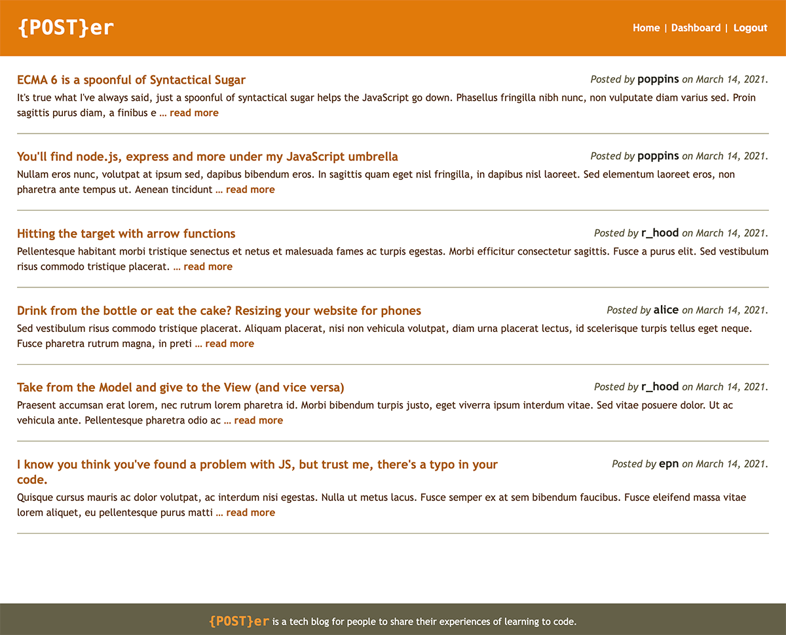

# **{POST}er**

## Table of Contents
* [Description](#description)
* [Installation](#installation)
* [Usage](#usage)
* [About The Developer](#about-the-developer)
  
## Description
{POST}er is a tech blog for people to share their experiences of learning to code.
### Built with
* CSS
* HTML – with [Express Handlebars](https://www.npmjs.com/package/express-handlebars)
* Javascript
* [Node.js](https://nodejs.org/en/)
  * [Express](https://www.npmjs.com/package/express)
  * [Node MySQL 2](https://www.npmjs.com/package/mysql2)
  * [Sequelize](https://www.npmjs.com/package/sequelize)
  * [dotenv](https://www.npmjs.com/package/dotenv)
  * [bcrypt](https://www.npmjs.com/package/bcrypt)

## Installation
To use the blog, there is no installation required, just visit the site (see Usage below).

However, if you would like to run your own version, you find it at this [GitHub repository](https://github.com/e-p-n/poster) and follow the instructions below to install it.
1. Using your command line application, clone the GitHub repository. Once completed, in your terminal/batch application navigate to the folder it was cloned to. 
2. Run “npm install” to download and install the necessary node extensions. 
3. Run MySQL and enter “source db/schema.sql”. This will create the “poster_db” database that you will be working with. Exit MySQL by typing “quit”.
4. Enter “npm start” . This will create the tables needed in the database and launch the server on port 3001, if installed locally.
5. Follow the Usage instructions below, but navigate to your copy of the blog (http://localhost:3001 for example) instead of the link provided below.

## Usage
1. Using a web browser, navigate to https://radiant-peak-23837.herokuapp.com.
2. From the homepage, you can click on any of the posts to read the full post and view any comments. If you want to comment or write your own posts you need to signup or login.
3. To login/signup, click on the login link in the menu bar. To login, enter your username and password and press the “login”  button. To signup for an account, click on the “Switch to signup”  link at the bottom of the page. Fill in the form with a chosen username and password and press “signup” .
4. Once you have logged in / signed up, you will be in the “Dashboard”  section. 
5. To create a post, click on the “new {post}”  button. Fill in the form with a title and post content. When you are ready to post your blog entry, press the “{post}”  button. You will be returned to the dashboard section and your new post will appear in a list with the title and date created.
6. To modify or delete your post, click on the title in the dashboard. Update your text in the Title and/or Content sections and press the “update {post}” button. To delete a post, click on the “delete {post}” button.
7. While logged in, click on the home button. When you click on any of the post on the home page, you can view the post and add comments. To add a comment, fill in the comment section and press the “add comment” section
8. To logout, press the logout link in the top right corner of the nav bar. The site will automatically log you out after 10 minutes of inactivity.

## About the Developer
{POST}er was developed and designed by Eric Normann, a student in the Full Stack Web Development Bootcamp program at U of T. Learn more about this and other projects he is working on at his [GitHub](http://github.com/e-p-n) page. 

If you have any questions, please [email](mailto:eric.n@me.com?subject=Question%20regarding%20E-commerce%20Backend) Eric.